# Grade Center
This Grade Center program is a tool to help teachers and professors keep track of student grading and results. It supports teachers to advise students by performing a calculation that shows what average a student needs to maintain to achieve an A through a Pass. It works by accessing a Google spreadsheet and using, manipulationg and adding information to it. 

You can view the live project [here](https://ci-pp33-gradebook.herokuapp.com/).

This project was choosen, because I have been working in higher education for study abroad programs for a number of years. They are often cut off from the more advanced systems of attendance and grading available on their home campuses, and they must resort to old-fashioned, time-consuming methods.

For this program to work the following Google sheets need to be set up:
- A roster/class list, which is a numbered list of students in the class.
- A worksheet for the "raw data". This is where unweighted results are stored as percentages. The user is asked how many points an exam or assignment was worth, and then asks for the score for each student. For example, if a student scores 20 points of 20 possible points, the grade recorded on the spreadsheet is 100.
- A worksheet for the adjusted and final results. This contains a tally of weighted points for each assignment. For example, for example if a student got a 100% result on a final exam worth 40% of the overall score, the grade with be worth 40 points of the overall term grade. These points are calcuated and plotted once the user enters the grades. 
- A worksheet that can store advising results. For any assignment which is not a the final exam, a calculation is made to show what average students need to achieve on any remaining assignments to achieve either an A, B, C, D or a Pass. In the situation a grade is unobtainable, "not possible" is written into the relevant field.

I believe it would be possible to create low cost tools for such educational programs that could perform such simple tasks. For example, most institutions I've worked with use Google. I have been able to create an attendance system using Google Apps Scripts. I think that Python offers a great deal more, and I would be excited to further develop this project into something fit for use for my employer. 

## The calculations
 ### Percent
 - Users are asked to enter the total points value for an assignment. This num1. Then for each student they enter the points each student achived. Let's say a homework assignment was worth 20 points, and a student earned 15 points (num2). It's a simple calcuation of (num2/num1)*100 or (15/20)*100 = 75.
 - Each assignment is given a weight. Each homework assignment in the app is worth 5% of the total grade. In the above case 75 * 0.05 = 3.75. So that's 3.75 of 5 possible points. 
 - The percentages students need to keep to achieve an A, B, C, etc work like this.
    - If you look at Bowie's column, you'll see his points add up to 54.65. Looking at the points possible for each assignment, you can see that he has earned 54.65 points out of 60 possible points so far.
    - He needs at least 94 points to get an A. The final exam is worth 40 points. 
    - To get an A he needs at least 94 percentage points 
        - 54.65 = 39.35
        - Bowie needs 39.35 percentage points for an A.
        - That means he needs a 98% average (39.65/40 * 100)

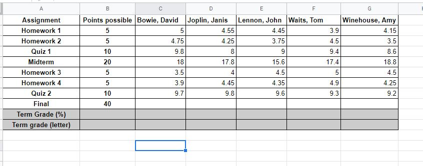

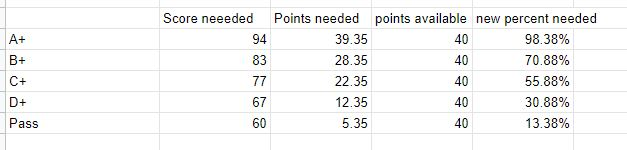

## How to use Grade Center
Grade Center initiates by offer users a set of options, for which they are prompted to enter the corresponding number. 
1. Enter grades
2. View individual student results
3. View class averages
4. Quit

### Option 1: Enter grades
When a user selects Option 1, they get the following information and prompts:
1. The user is informed for which assignment the program is collecting grades. For example, "Accepting grades for Homework." This will be the next item the list for which there is a "due" status.
2. They are asked for the total possible points. 
3. Once a points value is entered, they are asked to confirm it, in case it was mistyped. 
4. The teacher is then given the names of the students in alphabetical order and asked to enter the student's score. 
5. Once the student score is entered, the teacher is asked to confirm it is right, and, as above, the teacher has the option to enter a new grade.
6. Once all the grades are entered, the user is given statements to let them know the class average, 2 statements to let the user know what calculations the program is performing, and a final statement to ask them to wait for the options menu to appear.
7. The user is brought back to the Options menu.

### Option 2: View individual student results
When a user selects this option, they are shown their class roster, which is a numbered list of students, and they are prompted to select the student by their number. Once a student is selected, the user is shown 2 tables:
1. The first table is a list of all the assignments and the grades achieved by the students. 
2. The second table shows the averages a student must maintain on upcoming assignments/exams in order to achieve an A, B, C, D or a pass.
3. Under the table is a prompt asking the teacher if they'd like to view another student record. A positive reply brings you back to the class list, a negative reply brings you back to the Options menu.

### Option 3: View Class Averages
When a user selects option three they are shown a table with three columns:
- The date the grades were entered.
- The assignment
- The class average for each assignment.

### Option 4: Quit
This allows the user to exit the program. When the user enters "4", they are asked if they want to exit, and if confirmed the receive the message, "Thank you for using Grade Center," a negative response brings them back to the Options menu.

## User Experience
The target audience for this app are faculty members or teachers working within small educational institutions that don't resources for a CRM.  

As a user I want:
- An easy to access app that is easy to understand. It should require no or very little training/instruction.
- To be able to correct mistakes. 
- Feedback on what I am inputting. 
- To have scores weighted and calculated automatically
- View student records.
- View my class list and average results.
- To be able to better advise students, and intervene before any student is at risk of failing or underachieving. 

Examples of how the above is achieved is detailed in the features section below.

## Features

### User Story
- I would like this app to be easy to understand, without any or much training.
- I want feedback on what I am inputting. 

Implementation
- Options menu: when the app starts, the user has a simple options menu with choices to enter grades, view student records, view their class list with averages of previously entered grades or to leave the program. 

It is clear from this menu what information is available and what you can do at each menu option. 

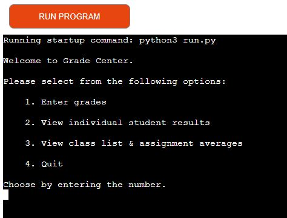

When the user selects Option 1, the program tells them for which assignmet the user is entering grades and asks for input. The teacher is asked to make this input as an integrer. 

It won't matter if those points have already been turned into a percent or if they want to enter the actual points the student scored based on a certain amount. For example, if an assignment or exam was worth 30 points, the teacher can enter that value and subsequently the scores earned by the student, such as 27, 28, 29. The figure will be converted into a percent. In the case the score has been calcuated by the teacher, then they can enter the total possible score as 100 and proceed to enter the numbers.

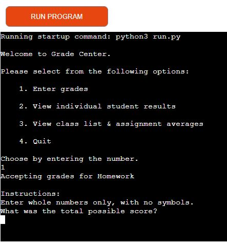

### User Story
I would like to be able to correct a mistake

IMPLEMENTATION

Every time a user makes an input they have the opportunity to correct a mistake. For example, on our current screen, the user will make a number of mistakes after being asked to enter the total score:
1. The user keys "enter"
    - Response: "Please enter a valid integer". "What was the total possible score?"
2. The user keys "space + enter"
    - Response: "Please enter a valid integer". "What was the total possible score?"
3. The cat walks over the keyboard, and random letters are entered.
    - Response: "Please enter a valid integer". "What was the total possible score?"
4. The user keys "10n"
    - Response: "Please enter a valid integer". "What was the total possible score?"
5. The user keys "1001"
    - Response: "You entered 1001. Is this correct? Respond with yes/y or no/n". While this is a valid number it is still unlikely. 
6. The cat is back, random letters are entered.  
    - Response: "Respond with yes/y or no/n"

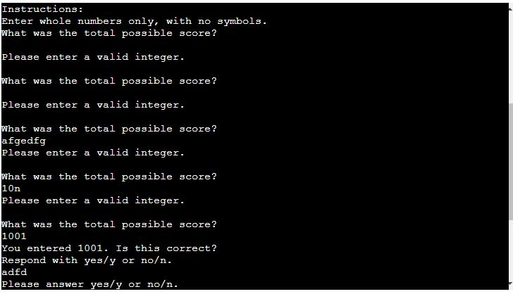

7. The user keys "enter" (seen here as a blank space)
    - Response: "Respond with yes/y or no/n"
8. The user keys "space + enter" (seen here as a blank space)
    - Response: "Respond with yes/y or no/n"
9. The user keys "n".
    - Response: "What is the total possible score"
10. The user enters "100"
    - Response: "You entered 100. Is this correct? Respond with yes/y or no/n".
11. The user keys "y".
    - Response: "Enter score achieved for David Bowie" (The first student on the class list)

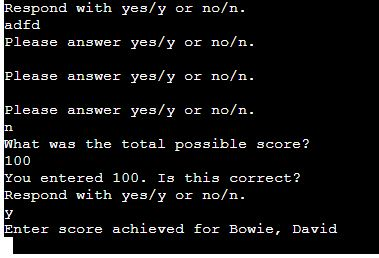

USER BENEFIT
Beyond the stated goals above, that the users can make so many mistakes surely must give them confidence. When incorrect entries are make they are told what is needed. 

### User Story
- I would like this app to be easy to understand, without any or much training.
- I would like feedback on what I am inputting.
- I want to be able to correct mistakes. 
- To have scores weighted and calculated automatically
- To be able to better advise students, and intervene before any student is at risk of failing or underachieving. 

IMPLEMENTATION

So far, the feedback that user has had has related to mistakes, although they did have their total scores entries fed back to them. Let's look at grade entry. 

Below are entries for 2 students: David, Bowie and Janis Joplin. 
The user was asked to enter a score, this is given back to them and they are asked if the entry is correct. Following a successful submission, they are told what the grade percent is and how many points that result will count towards the final term graded.

David Bowie's results are all correct.  

With Janis Joplin's entry, there is a mistake. The user put in a score above the possible points (910). The program recognizes this, and asks the user to enter a score up to the max they previously entered. In this case it is 100. The user enters 91, validates it with a "y" response and receives the percent and points values. 

The program moves through the rest of the students. Once all the grades are entered, the program processes the information and tells the user what it is doing with the following messages:

- Updating sheets and calculating class average
- Please  wait
- The class average for Homework was 88%
- Calculating points from weighted grades.
- Please wait for Options menu.

You can see these messages in the image below. 

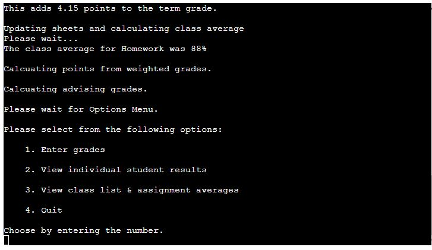

The user is asked to wait for the Options Menu to alert them to the fact that it takes a bit to appear again. 

USER BENEFITS
The user get immediate feedback on the information they gave without having too look at another one of the options immediately. I think this will make them confident about their entries and that the program is reliable. 

The Heroku window is too small to display all the student results, even in this case study with 5 students only. However, they would have access to their spreadsheet. 

Here are the grades as they appear in the spreadheet. This is on the tab called "grades_raw", which are the results entered by the user and calculated as a percent. 

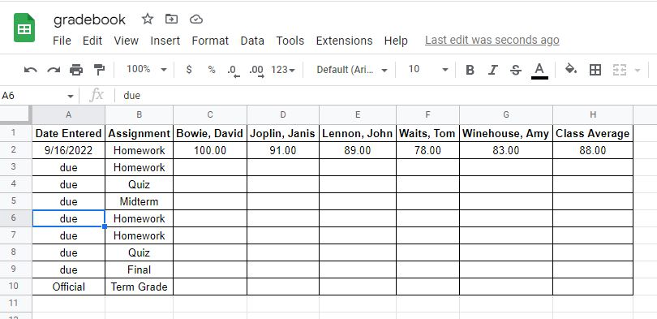

Notice that the date has been entered and all the results are present. This is an easy and familiar way to view results. 

On the second worksheet, "grades_adjusted_and_final", the weighted grades are displayed as points. The weighting would have had to have been pre-determind by the user. Here, the homework was worth 5% of the total grade. David Bowie got a 100 on his homework and therefore his result will contribute 5 points towards his final grade. 

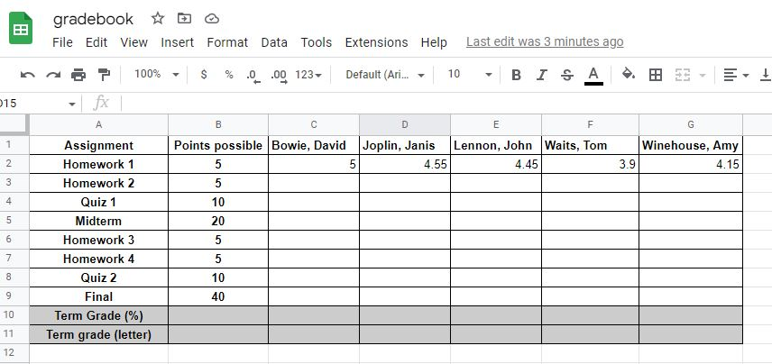

The next sheet, "final_result_needed" calculates the average a student needs to maintain in order to achieve an A, B, C, D or Pass. This is calculated with each entry, apart from the "Final" because it would no longer be relevant.

The user benefits, because they can't keep in their head the the progress of every student. Like this, if approached by a student, they can quickly get a sense of how the student is performing. Looking at these results would also enable an early intervention. Similarly, when looking at the student's results, the professor can put the students performance in the context of the class average. A student doesn't feel so bad about getting a B if the class average is a C. 

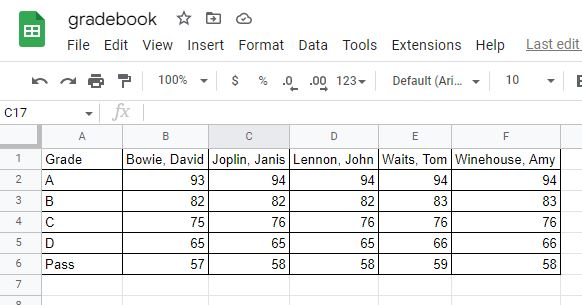

### User Story

- I want to be able to view student records.
- I want to be able to better advise students, and intervene before any student is at risk of failing or underachieving. 

IMPLEMENTATION

While the points above have explained in the above section, the user can also get this information via the app without consulting the Google Spreadsheet. 

Below, you can see that user has selected "2" from the Options Menu to "View class list & assignment averages". Here, you can see that the class list is displayed and the user is asked to select a student by their number. I have entered some more grades through the app to make it more meaningful. Let's choose John Lennon.

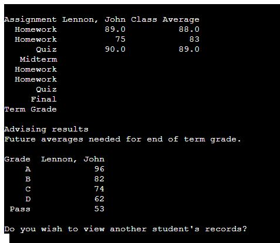

This information is displayed easily via pandas dataframes. 

USER BENEFITS

Using pandas dataframes makes it a snap to display spreadsheet information, so it would be easy and quick to make changes to what's displayed to the user following feedback. 

The user can at a glance see 
- all of John Lennon's grades, 
- compare these grades to the overall class average, and 
- see what John Lennon needs to do to pass with each grade. 

With such an app available for smart phones, the teacher/professor is in a strong position to advise students "on the fly" and when it is easy to access this information, they can keep better tabs on student progress. Similarly a dip in grades can be a sign a student isn't well. Having this quick access could enable faculty to alert well being services of their concern for a student. 

Inside this part of the program, the user is likely to access more than one student, unlike grades which might only be entered once a week or once every few weeks. Therefore, the user is asked whether they would like to see another record, rather than being brought back to the Options menu.

### User Story
- I want to be able to see my class averages. 

Faculty juggle a lot of classes and it's hard to keep track of new names with the start of a new term. 

IMPLEMENTATION

This display has been achieved in the app by using pandas dataframes.

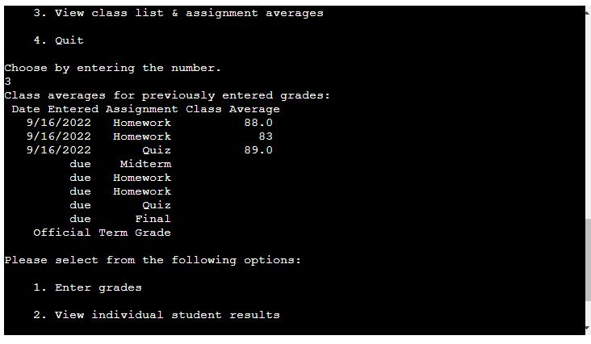

USER BENEFITS

The app allows faculty to look up their class, see who's in it and have a look at which assignments have been submitted. They can quickly get an overview of student performance and what's upcoming.

This quick access to student information would be extremely useful to adminstrators who are supervising faculty, and anyone who works in an Academic Affairs or Student Well Being department. A nose dive in grades is usually the first sign of a student not coping well. Also, if students are under performing in a class it may be a clue that a faculty member doesn't understand grading expectations. For example, the idea of a good result and what an "A" is different for British and American faculty. British professors in American study abroad programs need to in effect inflate their grades. Some students need As to maintain their finanical aid/scholarships, but often students don't make their concerns known until late in the term. This app could help, even if some adminstrators only had access to the class averages due to confidentiality. 

## Future Development
- I would like the user to be able to go in, select and assignment and replace the grades.
- I would like there to be an option of leaving a grade blank. The app should then perform all the calculations taking into account existing entries.
- At present, one can enter a ridiculous number as the total score possible. I would like to get the user to confirm numbers over 100.
- I would like the app administrator to be able to easily set up the app by importing or entering course numbers that could, for example, be in other Google Sheet. From there the spreadsheets would populate with the student names. 
- I would like the user to be able enter their  assignments, and enter the weights value for each. The current model assumes this will be done on the spreadsheet. 

## Data Model Design

Before I started programming this app, I created the flow charts below on [Lucid Chart](https://www.lucidchart.com/). 

In the diagram below, you can see that the app has 4 menu options, one of which is to quit the app. There are a few points of handing bad user input. From the options menu, this is at the point of choosing an option. 

There are 2 from the student records option. One to choose the number corresponding to the student, and again to decide whether or not to view another record.

Option 3, when chosen goes, directly to a display of information and the options menu is provided automatically.  

Option 4 ends the program. The yes/no response is checked. 

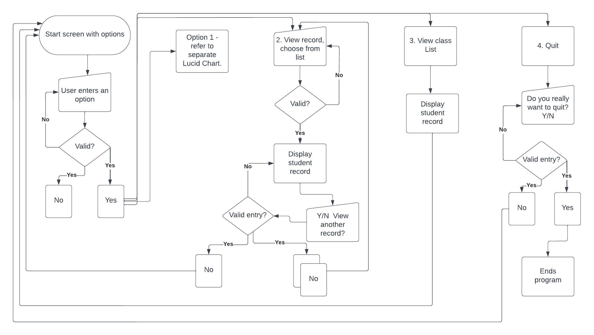

The chart below shows the flow of option 1, in which the user enters grades. There are several places where user input needs to be validated. What is not shown here are a couple of checks that happen within the program itself. For example, 
- if the user enters a student score that is larger than the total points possible that is previously entered, it gives them a related message and makes a new request for input. 
- when the averages are calculated to determine what a student needs for a A, B, C, D, or pass, if the points needed are greater than the points possible, the a message saying "Not possible" is written to the relevant field. 

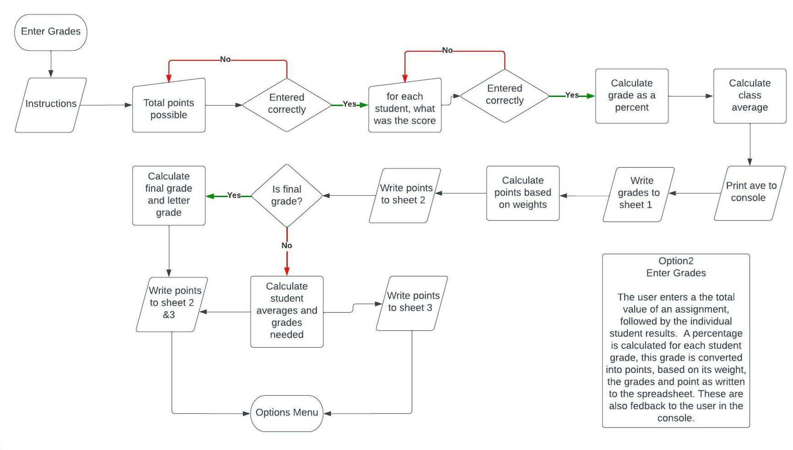

### Testing

I tested this project throughout it's development and made sure things worked before moving on to the next part of the flow chart. At the end of the project, I gave it a methodical check. By going through the program and inputting invalid responses. This testing can be viewed in this [Spreadsheet](https://docs.google.com/spreadsheets/d/1-awNb3E3dOYhpWWYCU1M3x4QjXDdBIR8rZImkCoN8xU/edit?usp=sharing)

I found and fixed 3 errors that are included in the section called bugs. I retested the places where these errors were muliple times. Two errors related to a user entering a number outside of a required range. The third was due to the lack of a "break" in a loop resulting in the user being asked a question again in spite of confirming with "yes". Here are the results of the testing:

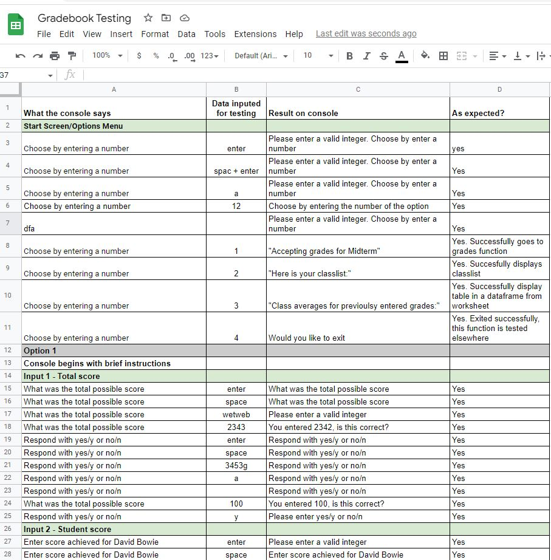
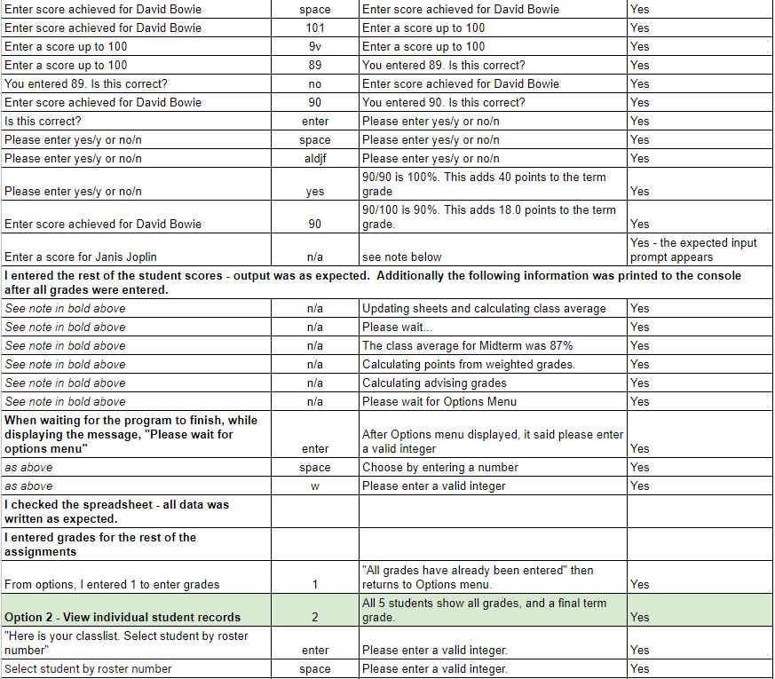
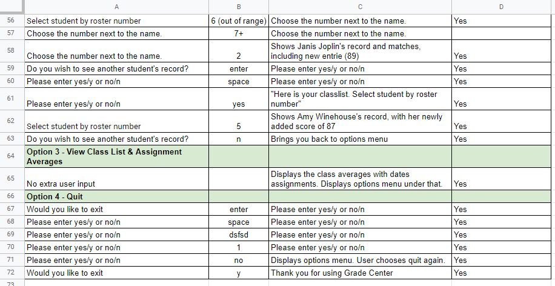

### Validator Testing
The code for this project was tested in the [PEP8 online](http://pep8online.com/checkresult). I did this through the project to get ahead of potential problems. My errors largely related to line length and trailing spaces. 

### Bugs
The vast majority of the "bugs" constituted me trying something out that I didn't really know how to do and it not working and then trying and testing it again and again until it did. 

Working with the Google Sheets offered up a lot of problems I wouldn't have anticipated, due to the necessity to repeated delete out information and start new. 

#### Solved
    - Stray data on the Google sheet broke the program by putting it "out of bounds" any time field data was captured dynamically. I didn't understand this at first and spent many hours trying to fix things that weren't actually broken.
    - I missed two places where a user could enter an out of range number which broke the program. 
        - The first was in the options menu. While the input was checked for being an integer, it didn't exclude the possibiliy of the user choosing a number outside of the range of 1-4. 
        - The second was in the get_student_input function. I check it wasn't greater than the number of students, but didn't think at the time to check for numbers less than 1.
    - Problems with the logic of yes/no exception in the check_answer(answer function)
    - I needed to fix the check_int() function to prevent it from crashing if a space was entered.
    - I got a lot of errors related to not converting strings into integers.
    - I struggled with getting row averages until I figured out I could append the grades into a list and install statistics into Python and use the mean() function to do it. 
    - I missed out closing brackets or quote marks. 
    - I didn't realize that the dataframes wouldn't always give me up-to-date data from the spreadsheet, in the same way I can call up with information from the worksheets. I had to set new variables in the functions that display student records and the class average page so that it would show new data that was entered. 
    - When I reduced my students, I forgot to adapt lists where that relied on them to be a certain number and I also forgot to remove the names on sheet one of the spreadsheet. 
    - The averages were coming out with a large number of decimal places so I had to use use round().
    - I left out a "break" in a loop which resulted in a question being asked again, following multiple bogus/invalid enters, although the user had answered "yes" to confirm their response. 

#### Unsolved
    - Write per minute quota errors:  when I test the program quickly and repeatedly, I get an error telling me I have exceeded the quota. It gives a website where you can request a higher quota. It at once told me that I hadn't met the quota and that I couldn't request more. I have possibly misunderstood this, but it is a great concern to me when this project is assessed. I am worried it will break when the assessors are testing. I cut my student list from 10 to 5 hoping that this would solve the problem but it didn't. 
    - I wanted it to be possible for the loop at lines ADD THEM HERE to be written so that the data would overwrite any existing data. This is relevant to future implementations. At present, the data needs to be manually deleted or new entries will be written out of range. 
    - There are a couple of places where I could not get a range dynanmically. I was able to do it in other places, but did not succeed everywhere. I ended up putting in a row or column number to solve the problem, which isn't ideal and I'd like to fix this in future. 
    - I couldn't seem to get any datetime functions to work, so I solved this by writing in the relevant formula I'd usually use for Sheets. I considered this unsolved. I had intended to go back and fix this, but ran out of time.

#### Other issues
- I had installed a number of packages I didn't end up using and subsequently uninstalled. I ran pip3 freeze > requirements.txt on the command line again to update the requirements file, but I can't see any changes. 
- Heroku seems to at times freeze up.

#### Potential problem for assessment
- There is not a way to clear the data from the spread automatically. There are only 9 rows to work with. It should be enough to test the app, but once all grades are entered, no more grades will be accepted, which will make further testing impossible without access to the spreadsheet. I am reluctant to give access to the Spreadsheet due to the number of problem I had with data being unintentional entered onto the sheet. Also, any dates in the "Date Entered" column need with be replaced with "Due Date" with no spaces after date. All the fields need to be exact.

## Libraries and Technologies Used
The following packages/libraries have been imported:
- Google Sheets
- google-auth:This uses the creds.json file to set up the authentication needed to access the Google Cloud project. 
    - google.oauth2.service_account: To allow the app to access Google Sheets, I followed the Love Sandwiches walk through to enable the Google Drive and Google Sheets APIs. This is described in the Deployment section below. 
    
- gspread: gspread is a Python API for Google Sheets, which we learned about in the Love Sandwiches walkthrough. In this app, I am using it to access my spreadsheet's data and to write data into it. 
- Pandas: This is a Python packgage that is using widely by data scientists. I've used it here to easily display back information to the user, and I found it useful for creating variables (for example the length of a row).
- The Python Statistics module - I used this specifically for the mean function. I tried to import the mean function only from the module but this didn't work. 
- I used [Lucid Charts](https://www.lucidchart.com/) to create the flowsheet.

## Setting up the environment

There was a lot to do to get this project set up prior to deployement. 

### Create a new project on Google Cloud Platform.
- Enable the Google Drive and Google Sheets APIs, to allow data sharing. To do this, go to the the APIs & Service menu then to libraries where you can search for these APIs.
- Generate credentials. Click the credentials button within the APIs and Services menu, and complete the fields. 
- Once the above is complete, you click the "Add Credentials Button" to create a service account name, selecting JSON for the key type. - Once the above is completed, a file is downloaded with credentials. 
### Set up GitHub repository and GitPod workspace, and link to Google
- Set up repository for the project on Git Hub, using Code Institute's "Python Essentials Template" and create a GitPod workspace, by clicking the GitHub button. 
- Add the downloaded credentials file into the GitPod workspace and rename it creds.json.
- Find the client email in the credentials. Go to the Google Sheet, share the spreadsheet with this email and give it full access to the spreadsheet.
- Add the creds.json file to "gitignore" to prevent it from being commited or sent to GitHub. 
### Install libraries and set global variables for access to the spreadsheet
- Install the libraries needed by entering "pip3 install + library_name" on the command line. e.g. "pip3 install google-auth".
- Import the libraries into the run.py file. For example, for google-auth write "from google.oauth2.service_account import Credentials" at the top of the file. 
- Set the scope by creating a global variable of the same name and listing the APIs the program has access to. 
- Create the the following variables to link up with the service account, create the gspread client and access the project's spreadsheet. 

        CREDS = Credentials.from_service_account_file('creds.json')
        SCOPED_CREDS = CREDS.with_scopes(SCOPE)
        GSPREAD_CLIENT = gspread.authorize(SCOPED_CREDS)
        SHEET = GSPREAD_CLIENT.open('gradebook')

Once the above was completed it was possible to begin writing the program.

## Deployment

To deploy this project, I relied on the Love Sandwiches walkthrough, which allowed me to deploy via Heroku. Heroku is a cloud application platform, operated by Salesforce, with which I had no prior knowledge before the walkthrough project.

1. Make sure that that any input method is followed by a new line (\n). This was described by Code Institute as a "quirk" of Heroku.
2. Run "pip3 freeze > requirements.txt" to add the environment's current package list into requirements.txt.
3. Go to Heroku.com. Set up an account if you don't have one, or other click on the "new" button to create a new app.
4. Add configuration variables to Heroku. This is where senstive data is stored. 
    - Enter PORT as a key and 8000 as a variable. This was told to us by Code Institute.
    - Give Heroku access to your creds.json file. The PORT this time is CREDS, for the key, you need to copy in the contents of your creds.json file in GitPod or other IDE.
5. Add Buildpacks by clicking on Buildpacks and selecting python and node.js, making sure they are listed in that order.
6. Go to deploy on the menu. In my case, I needed to choose GitHub as my deployment method.
7. Go to "Connect to GitHub", choose your repository, and use the connect button. I enabled the "automatic deploy" which means that any time I push changes to GitHub, Heroku will update automatically. 
8. Launch the app

## Credits
As ever I would like to thank my mentor Daisy McGirr for her amazing support.
- Code Institute's Python Essentials module
- [Gspread documentation](https://docs.gspread.org/en/latest/)
- [Pandas documentation](https://pandas.pydata.org/docs/)
- [W3 Schools](https://www.w3schools.com/) for quick reference
- This video, [Complete Python Pandas Data Science Tutorial!](https://www.youtube.com/watch?v=vmEHCJofslg&t=690s), but Keith Galli was incredibly helpful for coming to grips with Pandas.
- I refered to the [Python-course.eu](https://python-course.eu/python-tutorial/errors-and-exception-handling.php) website related to expception handing. 
- I had a look at this [Grade Calculator](https://www.rapidtables.com/calc/grade/grade-calculator.html) by Rapid Tables to check my calculations.
- [Python Style Guide](https://peps.python.org/pep-0008/)
-[15 Python tips and tricks, so you don’t have to look them up on Stack Overflow](https://medium.com/@george.seif94/15-python-tips-and-tricks-so-you-dont-have-to-look-them-up-on-stack-overflow-90cec02705ae) - I found this a useful for iterating over a dictionary.

